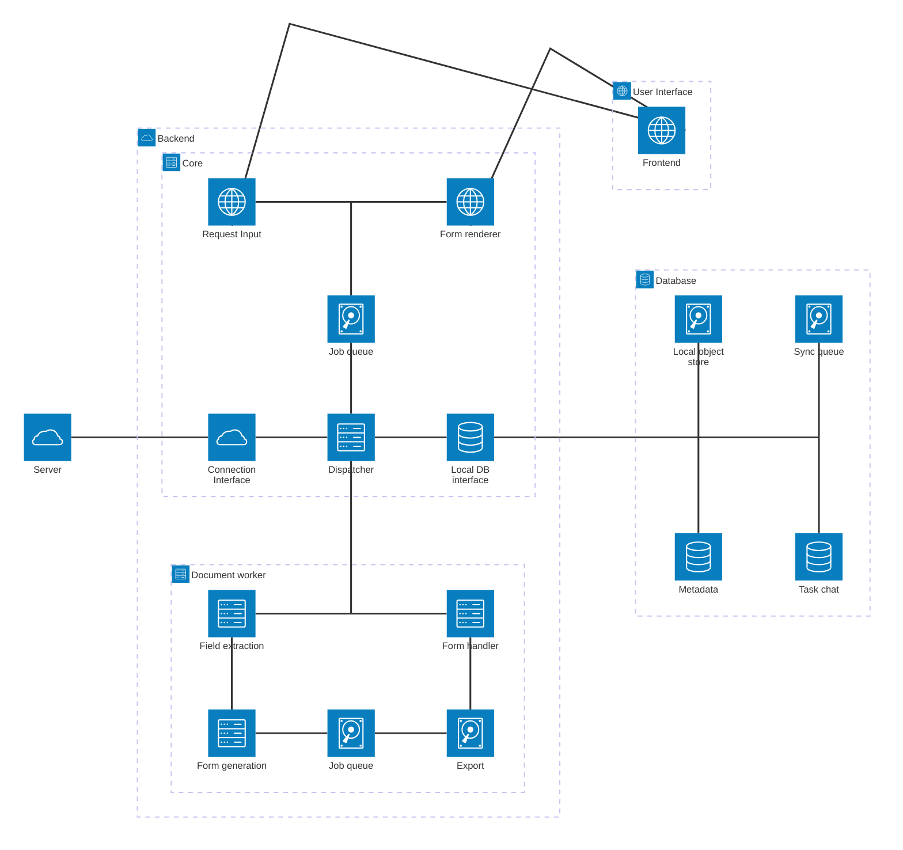

```mermaid
architecture-beta
    group backend(cloud)[Backend]
    group core(server)[Core] in backend
    group worker(server)[Document worker] in backend
    group front(internet)[User Interface]
    group database(database)[Database]

    service frontend(internet)[Frontend] in front
    service server(cloud)[Server]

    service rq_input(internet)[Request Input] in core
    service form_render(internet)[Form renderer] in core
    junction jq_in in core
    service job_queue(disk)[Job queue] in core
    service conn_interface(cloud)[Connection Interface] in core
    service dispatcher(server)[Dispatcher] in core
    service local_db_interface(database)[Local DB interface] in core

    junction jw in worker
    service field_extraction(server)[Field extraction] in worker
    service form_hand(server)[Form handler] in worker
    service form_gen(server)[Form generation] in worker
    service export(disk)[Export] in worker
    service job_queue_clone(disk)[Job queue] in worker

    junction j1 in database
    junction j2 in database
    service local_obj_store(disk)[Local object store] in database
    service metadata(database)[Metadata] in database
    service sync_queue(disk)[Sync queue] in database
    service task_chat(database)[Task chat] in database

    %% request input and form renderer both feed the job queue through a junction
    frontend:R -- B:rq_input
    rq_input:R -- L:jq_in
    form_render:L -- R:jq_in
    jq_in:B -- T:job_queue

    %% dispatcher row
    job_queue:B -- T:dispatcher
    server:R -- L:conn_interface
    conn_interface:R -- L:dispatcher
    dispatcher:R -- L:local_db_interface

    %% DB fan-out via junctions
    local_db_interface:R -- L:j1
    j1:T -- B:local_obj_store
    j1:B -- T:metadata
    j1:R -- L:j2
    j2:T -- B:sync_queue
    j2:B -- T:task_chat

    %% worker fan-out via junction
    dispatcher:B -- T:jw
    jw:L -- R:field_extraction
    jw:R -- L:form_hand
    field_extraction:B -- T:form_gen
    form_hand:B -- T:export
    form_gen:R -- L:job_queue_clone
    export:L -- R:job_queue_clone

    %% return path to the frontend
    form_render:B -- R:frontend
```